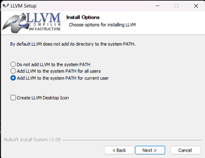

# Student Organization for Aerospace Research

This Organization will host all SOAR programs.

# General Github Usage Guidelines

1. Reach out to the software executive team if you would like to add a new repository.
2. All repositories and relevant folders should have a good descritpive README that uses the following template. You have freedom to edit as required as long as its sensible. <a href="https://github.com/UCSOAR/TemplateRepository/blob/master/README.md" target="_blank">README Template</a>
3. Branch names should be Name/ProjectDescr
4. Have short but descriptive commit messages. Every commit should have a short straightforward message that will inform third parties clearly on the intention of that commit
5. ALL Pull Requests must follow the guidelines in the following <a href="https://docs.google.com/document/d/1gK7U7JyYIshEkUTerLHe_wzck6jy2xmAXTzNXDz3xdQ/edit" target="_blank">Pull Requests Guide</a>
6. Just keep good organization on your mind all the time
7. Github Guide <a href="https://docs.google.com/document/d/1d9vX7qOhwl5sKVMaC0NQqCqidDwsqfF1K62peDyTEsM/edit?usp=sharing" target="_blank">SOAR Github Guide</a>

# Setup

To be able to commit code on this repository you will need clang and pre-commit setup on your computer.

## Clang Setup

### Windows

1. Download <a href="https://github.com/llvm/llvm-project/releases/download/llvmorg-18.1.8/LLVM-18.1.8-win64.exe" target="_blank">LLVM-18.1.8-win64.exe</a>
2. Make sure to add it to your path in the setup menu



### Mac

@EtSubas please complete this section

## Pre-commit Setup

1. Run ```pip install pre-commit```
2. At the root of all your repositories run ```pre-commit install```
